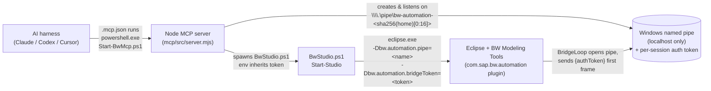
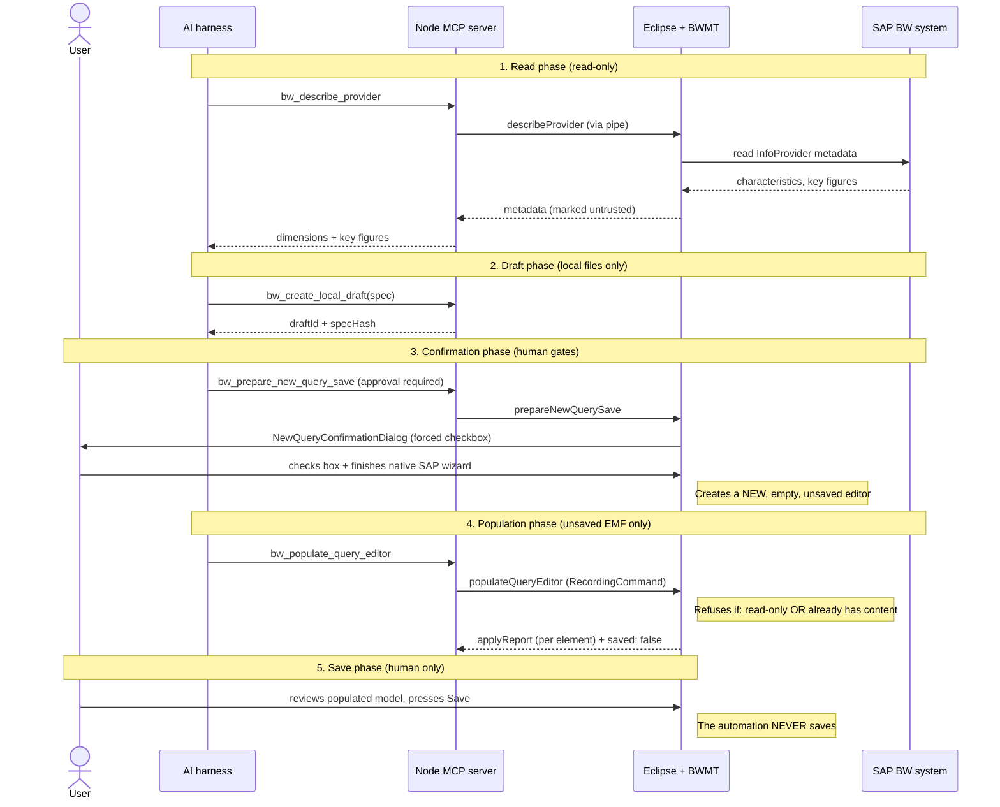
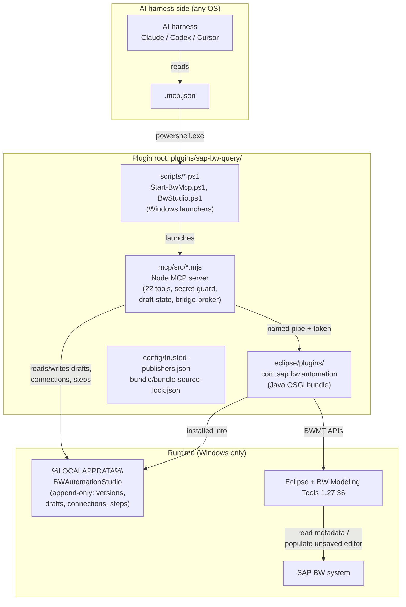

# Architecture & Security — SAP BW Query Automation Studio

> **Plain-language summary first, technical detail below.** This document explains how the SAP BW Query Automation Studio plugin works end to end, what its 22 tools do, how the AI connects to it, and — most importantly — why it is safe to let an AI assistant drive SAP BW Query Design through it.

---

## Executive summary (plain language)

SAP BW Query Automation Studio lets an AI coding assistant (like Claude, Codex, or Cursor) help you build SAP BW queries **inside your existing Eclipse-based BW Modeling Tools** — without the AI ever touching your password, your saved queries, or your transports.

Think of it as a **read-and-draft helper with a human gate on everything that matters**:

- The AI can **look** at your BW system: list queries, read the dimensions and key figures of an InfoProvider, and inspect an open query's structure.
- The AI can **draft** a new query specification locally (a JSON file on your machine) and check it against your live BW metadata.
- When you're happy with the draft, the AI can **fill in** a brand-new, still-unsaved query editor in Eclipse — but only one that the native SAP "New Query" wizard just created, and only with a confirmation dialog you must actively check.
- **The AI never saves.** It never activates, never transports, never deletes, never overwrites. You press Save yourself, after reviewing what was populated. Existing queries are strictly read-only.

The connection between the AI and Eclipse runs over a **local Windows named pipe** (not the network) and — after the 2026-08-05 security hardening — is **guarded by a per-session secret token** that changes every time the server starts. No remote attacker can reach it, and no other program on your machine can drive it without the token.

**Bottom line for end users:** you stay in control of every state-changing action. The AI does the tedious metadata lookup and query drafting; you do the confirming and saving. Passwords are never accepted by the automation — you always type them in the normal SAP login dialog.

---

## How the AI connects (without you configuring a path)

This is the most common question: *"If the MCP server lives inside the Eclipse plugin, how does the AI harness find it?"*

**Answer: both sides independently compute the same pipe name from your Windows home directory. Nothing is configured, exchanged, or discovered at runtime.**

**Step by step:**

1. The AI harness reads `.mcp.json` and runs `powershell.exe Start-BwMcp.ps1`.
2. `Start-BwMcp.ps1` resolves `BW_AUTOMATION_HOME` (default `%LOCALAPPDATA%\BWAutomationStudio`) and launches the Node MCP server (`mcp/src/server.mjs`).
3. The Node server computes the pipe name — `\\.\pipe\bw-automation-` + the first 16 hex characters of `sha256(your_home_dir)` (`bridge-broker.mjs:21-24`) — generates a random 32-byte auth token, and **listens** on that pipe.
4. When the AI calls `bw_studio_launch`, the Node server spawns `BwStudio.ps1 Start-Studio`, which launches `eclipse.exe` with `-Dbw.automation.pipe=<name>` **and** `-Dbw.automation.bridgeToken=<token>` (the token is inherited via the `BW_AUTOMATION_BRIDGE_TOKEN` env var).
5. The Eclipse plugin's `BridgeLoop` (`BridgeLoop.java`) opens the pipe and sends `{"authToken":"<token>"}` as its very first message. The Node server validates it; on mismatch it closes the connection.
6. From then on, the AI's tool calls flow: AI → Node MCP server → named pipe → Eclipse `BridgeLoop` → `BwmtAdapter` → BW Modeling Tools / live BW system, and responses flow back the same way.

**Why this is safe:** the pipe is machine-local (no host/port, no `0.0.0.0` exposure), the name is a one-way hash of your home path (not guessable from outside), and the per-session token means even another program running as your user can't connect without it. Single connection slot, 15-second timeout.

---

## What the 22 tools do (and what they cannot do)

The tools are classified into three operation classes. The classification is enforced in the tool registry and advertised to the AI harness via MCP annotations.

### Read-only tenant (look, don't touch — BW backend)
| Tool | What it does |
|------|--------------|
| `bw_connection_test_reachability` | TCP connect check to the app/message server. **Never attempts SAP logon** — returns `authenticated: false`. |
| `bw_inspect_capabilities` | Reports which features the live BW Modeling Tools support (`providerMetadataSupported`, `populateSupported`, `modelReadSupported`). |
| `bw_describe_provider` | Lists the characteristics (with dimension groups), key figures, and dimensions of an InfoProvider via BWMT connectivity. Offline → `metadata.available: false` with a "log in via native dialog" instruction. |
| `bw_list_queries` | Lists queries currently open in editors (not a backend catalog scan). |
| `bw_read_query` | Shallow summary of an open query. |
| `bw_read_query_model` | Deep serialization of an open query's full EMF model (axes, structures, selections, filters, conditions, exceptions, display). Strictly read-only. |
| `bw_review_query` | Runs the 12-rule best-practices engine (BWQ001–BWQ012) over an open query's deep model. Read-only. |

### Local-only (your machine — files, drafts, studio lifecycle)
| Tool | What it does |
|------|--------------|
| `bw_studio_status` | Reports installed versions, active version, home path, and (since the hardening) the build **provenance** (source commit). |
| `bw_studio_deploy` ⚠️ | Installs/verifies a signed (or explicitly-opted-in unsigned) bundle into `%LOCALAPPDATA%`. **Classified `destructive` + approval required** after the hardening; unsigned bundles need `BW_AUTOMATION_ALLOW_UNSIGNED_BUNDLE=1`. |
| `bw_studio_launch` | Launches `eclipse.exe` with `-noPwdStore`. |
| `bw_studio_rollback` | Re-points the active version at an existing installed version. Append-only — **never deletes**. Classified `destructive` + approval required. |
| `bw_studio_diagnostics` | Reports retained staging/download directory counts. `cleanupAvailable: false` (no automated deletion). |
| `bw_connection_prepare` | Writes connection metadata (system, client, app server, etc.) to a local JSON file. **No password field exists** in the schema. |
| `bw_connection_import_landscape` | Parses a SAP GUI landscape XML into connection metadata. **Confined to `<home>/landscapes`** (or an opt-in allow dir) after the hardening — no arbitrary file reads. |
| `bw_connection_status` | Returns the most recent connection record for an alias. |
| `bw_project_create_or_open` | Checks whether a BW project exists; never creates one (returns `userActionRequired: true` if absent). |
| `bw_resolve_and_validate_spec` | Validates a draft query spec; with an `alias`, fetches live provider metadata to verify every referenced characteristic/key figure. Returns `metadataChecked`, `readyForDraft`, and a `bestPractices` array. |
| `bw_create_local_draft` | Persists a validated draft spec as a local JSON file (with a `specHash`). |
| `bw_apply_spec_to_draft` | Updates a draft (only while it's still in the `LOCAL_DRAFT` state). |
| `bw_preview_draft` | Opens a preview wizard in Eclipse. No save. |
| `bw_populate_query_editor` | Fills the **unsaved in-memory EMF model** of a wizard-created editor. Refuses read-only editors, refuses editors that already have content, runs inside an EMF `RecordingCommand`, and **always returns `saved: false`**. The human saves. |

### Mutating tenant (the one approval-required BW-facing tool)
| Tool | What it does |
|------|--------------|
| `bw_prepare_new_query_save` ⚠️ | **Explicit approval required.** Checks the technical name isn't already in use (overwrite is permanently blocked), binds the spec hash, flips the draft to `SAVE_PENDING_HUMAN`, opens a human confirmation dialog in Eclipse (checkbox must be checked), and opens the native SAP "New Query" wizard. **Does not save** — the human finishes the wizard and presses Save. |

### What does NOT exist (by design)
There are **zero** tools for: `save`, `delete`, `drop`, `overwrite`, `transport`, `release`, `activate`, `cleanup`, `uninstall`, or `raw-command`. The Eclipse-side `CapabilityProbe` advertises `deleteSupported: false` and `overwriteSupported: false`. This is verified by the test suite.

---

## The query-creation flow (the only state-changing path)

**Three independent layers block overwriting an existing query:**
1. `draft-state.mjs:86-88` — the draft's `prepareSave` rejects a technical name already in use ("overwrite is permanently blocked").
2. `QueryEditorGateway.java:49-53` — population refuses read-only editors.
3. `QueryEditorGateway.java:61-68` — population refuses any editor that already `hasContent()` ("existing queries are never modified").

A binding-hash match (`specHash`) ties the populated model back to the confirmed draft, so a mismatch is always caught.

---

## Security summary

The plugin was adversarially audited (3 exploration agents + controller verification) and hardened on 2026-08-05. Full details: [`docs/project/sap-bw-query-security-audit-2026-08-05.md`](../../../../../docs/project/sap-bw-query-security-audit-2026-08-05.md).

### Threat model
The realistic attackers are: (a) a **prompt-injected AI** tricked by malicious BW content or a compromised instruction, and (b) a **malicious local process** running as the same user. Remote network attackers cannot reach the pipe (it's machine-local).

### Controls that make the BW-facing surface safe by design
| Control | Where |
|---------|-------|
| **No auto-save** — every mutation leaves saving to the human | `QueryEditorGateway.java` instruction text; `bw_populate_query_editor` returns `saved: false` |
| **Overwrite blocked 3×** — duplicate name, read-only editor, non-empty editor | `draft-state.mjs:86-88`; `QueryEditorGateway.java:49-53, 61-68` |
| **No destructive tools** — no delete/drop/transport/release/activate | `tool-registry.mjs`; `CapabilityProbe.java:46-47` |
| **`assertNoSecrets` bidirectional** — every request payload AND every bridge response is scanned for credentials | `bridge-broker.mjs:101,110`; `tool-handlers.mjs:12` |
| **Array-spawned PowerShell** — no `shell: true`, so metacharacters can't break out | `studio-service.mjs:41` |
| **Append-only deploys** — versions never overwritten/deleted; content-addressed | `BwStudio.ps1` `Install-Studio` |
| **Hash-pinned downloads** + zip-slip protection + bundle inventory SHA-512 | `Build-BwStudio.ps1`, `BwStudio.ps1` `Test-ArchivePaths` |

### Security hardening applied (2026-08-05, 9 findings closed)
| # | Severity | What was fixed |
|---|----------|----------------|
| 1 | High | **Named-pipe auth** — per-session 32-byte token required as the first frame; no token ⇒ connection rejected. Wired end-to-end (Node generates → env → BwStudio.ps1 → Eclipse JVM property). |
| 2 | High | **Unsigned-bundle deploy gated** — 3 layers (Node handler + manifestPath-presence + PowerShell) now require `BW_AUTOMATION_ALLOW_UNSIGNED_BUNDLE=1`. Was the only working deploy path before (signed keys shipped empty). |
| 3 | High | **`importLandscape` confined** — can only read files under `<home>/landscapes` or an opt-in allow dir. Was an arbitrary local-file read. |
| 4 | Med | **BW content marked untrusted** — all read-only-tenant responses carry a `_untrustedContent` marker so the AI treats BW object names/descriptions as data, not instructions (prompt-injection defense). |
| 5 | Med | **Secret-guard widened** — keylist now catches `authorization`, `accesstoken`, `bearer`, etc.; bare `Bearer …`/`Basic …` values; zero-width-unicode bypasses. Mirrored on the Java side. |
| 6 | Med | **Release-channel SSRF blocked** — download hosts must pass `Test-ReleaseHostAllowed` (default-denies RFC1918/loopback/link-local/metadata/`fe80::/10`); opt-in strict allowlist. |
| 7 | Med | **Real provenance pin** — build now emits a real git commit into `dist/provenance.json`; surfaced via `bw_studio_status`. The old `"source-commit"` placeholder was inert. |
| 8 | Low | **`-ExecutionPolicy Bypass`** — documented as safe (array args, no shell) and required for locked-down Windows policies. No code change. |
| 9 | Low | **Desktop shortcuts opt-in** — `.lnk` files created only if `BW_AUTOMATION_CREATE_SHORTCUTS=1` (was opt-out). No more surprise desktop clutter from AI-driven deploys. |

### Environment variables (the human-facing opt-ins)
| Variable | Purpose | Default |
|----------|---------|---------|
| `BW_AUTOMATION_BRIDGE_TOKEN` | Per-session pipe auth token (auto-generated; set by the Node server) | auto (64 hex chars) |
| `BW_AUTOMATION_ALLOW_UNSIGNED_BUNDLE` | Opt-in for unsigned-local bundle deploy | unset (deny) |
| `BW_AUTOMATION_LANDSCAPE_ALLOW_DIR` | Extends `importLandscape` file confinement beyond `<home>/landscapes` | unset |
| `BW_AUTOMATION_RELEASE_HOST_ALLOWLIST` | Semicolon-separated strict allowlist for release-channel download hosts | unset (default-deny private ranges) |
| `BW_AUTOMATION_CREATE_SHORTCUTS` | Opt-in for desktop `.lnk` creation on deploy | unset (no shortcuts) |
| `BW_AUTOMATION_PLUGIN_COMMIT` | Build-time provenance override (40-hex); `"source-commit"` is the dev placeholder, never surfaced | `"source-commit"` in source; real hash in built bundle |

---

## Component map

### Key source files (for maintainers)
- **MCP entry & transport:** `mcp/src/server.mjs`, `mcp/src/bridge-broker.mjs`
- **Tools & guards:** `mcp/src/tool-registry.mjs`, `mcp/src/tool-handlers.mjs`, `mcp/src/secret-guard.mjs`, `mcp/src/untrusted-content.mjs`, `mcp/src/connection-store.mjs`, `mcp/src/draft-state.mjs`
- **Launchers:** `scripts/Start-BwMcp.ps1`, `scripts/BwStudio.ps1`, `bundle/Build-BwStudio.ps1`
- **Eclipse bridge & adapter:** `eclipse/plugins/com.sap.bw.automation/src/com/sap/bw/automation/bridge/BridgeLoop.java`, `core/BwmtAdapter.java`, `core/QueryEditorGateway.java`, `core/QueryModelBuilder.java`, `core/QueryModelReader.java`, `core/ProviderMetadataGateway.java`, `core/CapabilityProbe.java`, `core/StepJournal.java`, `ui/NewQueryConfirmationDialog.java`

---

## Build & test

- **MCP server (Node):** `cd mcp && npm ci --ignore-scripts && npm run build` (esbuild → `dist/server.mjs` + `dist/provenance.json`). Cross-platform.
- **Tests:** `node --test tests/sap-bw-query/*.test.mjs` — 160 tests. On macOS, 151 pass / 7 fail / 2 skip (the failures spawn `powershell.exe`, which is Windows-only — they pass on the `windows-2025` CI leg).
- **Eclipse plugin (Java/OSGi) + bundle builder + signed release:** strictly Windows. Compiled imperatively via `Build-BwStudio.ps1` (`javac --release 21` against the deployed BWMT 1.27.36 jars). No `pom.xml`/Tycho.
- **What needs a live BW system:** only the read tools (`describeProvider`, etc.) and the end-to-end population round-trip. The MCP server, tool handlers, spec validation, secret-guard, connection logic, and bridge-auth handshake are all unit-testable without BW.

For Windows-side runtime validation of the PowerShell/Java layers, see the [Windows validation handoff](../../../../../docs/project/sap-bw-query-windows-validation-handoff.md).

---

## Related documents
- [Security audit & hardening summary](../../../../../docs/project/sap-bw-query-security-audit-2026-08-05.md) — full findings table, evidence, commit mapping
- [Windows validation handoff](../../../../../docs/project/sap-bw-query-windows-validation-handoff.md) — runbook for validating the Windows-only halves
- [MCP tools reference](./mcp-tools.md) — detailed per-tool contracts
- [Portable deployment and trust](./deployment-and-trust.md) — deploy/sign/rollback mechanics
- [BWMT API map](./bwmt-api-map.md) — reflective BW Modeling Tools API calls
- [Query specification v1](./query-spec-v1.md) — the draft JSON schema
